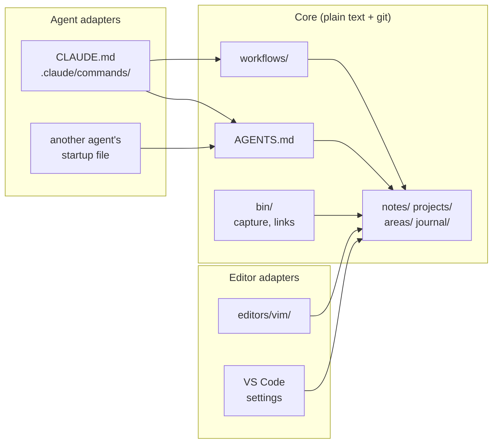
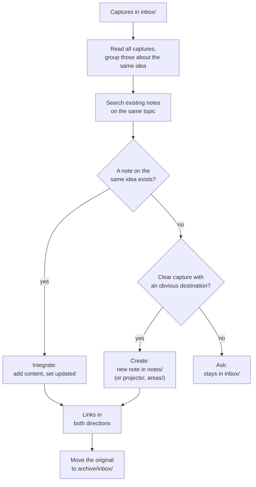
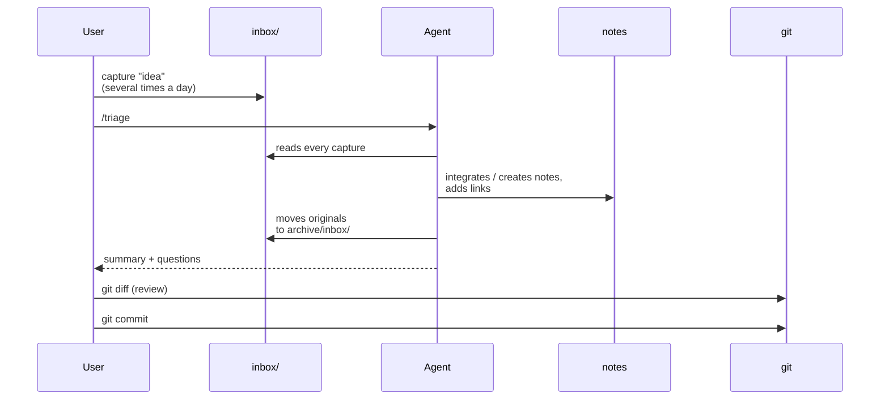

# Agnostic second brain: notes, editors and agents

A **second brain** is a personal archive of notes where you collect, connect and retrieve ideas. This one is nothing but plain text files, mostly *Markdown*, versioned with *git*. Any editor reads and writes the notes; an AI agent (for example *Claude Code*) triages, links and queries them. No database, no proprietary app, no format that needs a specific program to be read.

The design rests on one constraint: **tool agnosticism**, on two axes. The archive must depend neither on the editor (Vim, VS Code, anything else) nor on the agent (Claude Code today, another one tomorrow). The answer is the same on both axes: a plain-text **core** that holds everything of value, plus thin, replaceable **adapters** that plug a tool into the core.

This repository contains this document, the `init.sh` script and the templates it installs (in `template/`).



Every arrow points **towards** the core: that is the whole architecture.


## 1. Core and adapters

The **core** holds everything of value and knows nothing about tools. **Adapters** know everything about the core and hold nothing of their own. It is the *hexagonal architecture* (*ports and adapters*) applied to notes: the core defines the contract (the format, the instructions) and each tool conforms to it.

> The rule of thumb: something belongs to the core if it still makes sense after uninstalling every editor and every agent.

| Core                                   | Adapters                                   |
|----------------------------------------|--------------------------------------------|
| the notes, in their format             | `CLAUDE.md` (one line: `@AGENTS.md`)       |
| the folder structure                   | `.claude/commands/*.md` (a few lines)      |
| `AGENTS.md`, the agent instructions    | `editors/vim/brain.vim`                    |
| `workflows/`, the procedures, in prose | VS Code settings and extensions            |
| `bin/`, POSIX shell scripts            | agent hooks that call `bin/`               |
| the git history                        | caches and indexes of any tool             |

An adapter follows four rules:

1. **It is thin.** A few lines; if it grows, it is absorbing logic that belongs to the core.
2. **It points one way.** Adapters depend on the core, never the other way round. A note, workflow or script may *mention* a tool, never *require* one.
3. **It has no state of its own.** Caches and indexes can be rebuilt, so they are expendable.
4. **It is replaceable.** You can delete it and write one for another tool in minutes.

Rule 2 is the easiest to break. Agent-specific features such as *hooks* invite you to put logic inside them; instead, put the logic in a script in `bin/` and let the hook just call it.

The payoff is that switching tools costs one adapter, not a migration of every note. To check that the boundary is right, mentally delete `CLAUDE.md`, `.claude/`, `editors/` and every other adapter: you should still be able to capture, read, search, link and version the notes with `cat`, `grep`, any editor and `git`.

```sh
# search: notes mentioning "poisson" (-r recursive, -l file names only,
# -i ignore case)
grep -rli 'poisson' notes/ projects/ areas/ journal/

# backlinks: notes linking to poisson-process.md; [(/] matches the
# character before the name, "(" for a link from the same folder,
# "/" for one like ../notes/poisson-process.md, so that
# compound-poisson-process.md does not match
grep -rl '[(/]poisson-process\.md)' notes/ projects/ areas/ journal/

# history: every commit that touched notes/, one per line
git log --oneline -- notes/
```


## 2. Archive layout

```
brain/
├── AGENTS.md          # instructions for any agent
├── CLAUDE.md          # adapter: imports AGENTS.md
├── inbox/             # raw captures, waiting for triage
├── notes/             # atomic notes, flat, one idea per file
├── projects/          # things with an end (exams, a thesis, a repo)
├── areas/             # ongoing responsibilities (study, career, this system)
├── journal/           # daily notes, YYYY-MM-DD.md
├── archive/           # retired notes: nothing is deleted, only moved
│   ├── inbox/         # original captures, already triaged
│   └── answers/       # saved answers, already distilled
├── workflows/         # procedures in prose, for people and agents
├── answers/           # saved answers from ask, not notes
├── bin/               # POSIX scripts (capture, links)
├── editors/           # editor adapters (vim/, ...)
└── .claude/
    └── commands/      # adapter: each command points to a workflow
```

The `projects/` / `areas/` / `archive/` split is a simplified version of Tiago Forte's *PARA* method: "resources" become `notes/`, and `inbox/` and `journal/` are added.

- **`notes/` is flat**, with no subfolders by topic. Structure comes from tags and links: an idea can belong to several topics, and a note that never moves never breaks the links pointing at it.
- **`archive/inbox/`** receives captures once triage has turned them into notes, so you can check that nothing was lost. **`archive/answers/`** does the same for saved answers once `distill` has brought their new content into notes.
- **The rest of `archive/`** holds *retired* notes, such as a finished project or a superseded note. A retired note keeps its original folder (`projects/exam.md` $\to$ `archive/projects/exam.md`). Moving it changes relative paths, so its own links and the links pointing to it must be updated. Links from active notes that you forget to update show up as broken links in `connect`.
- **`answers/`** holds `ask` answers you asked to save. They are not notes: `ask` searches them only on request ([§6.2](#62-ask)), and notes never link to them. They are versioned like everything else.


## 3. Setup

A new archive needs three things: the folders and files of the core (plus the adapters you want), a git repository, and two lines in your shell profile.


### 3.1 With `init.sh`

```sh
# download the templates (--depth 1: latest version only, no history)
git clone --depth 1 https://github.com/matteogiorgi/second-brain.git

# create ~/brain with the core plus the Claude Code and Vim adapters
second-brain/init.sh --claude --vim ~/brain
```

The templates in `template/` are split into layers that mirror the core/adapter split:

| Layer    | Option     | Creates                                                                                                          |
|----------|------------|------------------------------------------------------------------------------------------------------------------|
| `core`   | always     | the folders, `AGENTS.md`, `.gitignore`, `workflows/` (triage, ask, connect, distill), `bin/capture`, `bin/links` |
| `claude` | `--claude` | `CLAUDE.md` and `.claude/commands/` (`/triage`, `/ask`, `/ask-save`, `/ask-all`, `/connect`, `/distill`)         |
| `vim`    | `--vim`    | `editors/vim/brain.vim`                                                                                          |
| `docs`   | `--docs`   | `areas/second-brain.md` and four notes in `notes/` documenting the system                                        |

`--all` enables every layer; `init.sh -h` prints the help. The destination folder is required and can be anywhere.

The script is conservative:

- **it never overwrites** a file, so you can re-run it to add a layer to an existing archive (`init.sh --docs ~/brain`);
- **outside the archive it only touches `~/.profile`**, appending `BRAIN` and `PATH` for the first archive you create, and leaving the profile alone if a default archive is already set;
- **it never commits**: it runs `git init`, adds `.gitkeep` to empty folders and makes `bin/` executable, but the first commit is yours.

When it finishes, it prints the next steps for the options you chose. Afterwards you can delete the `second-brain/` clone: the archive does not depend on it.


### 3.2 By hand

These steps do the same as `init.sh`, starting from the templates in a clone of this repository:

```sh
git clone --depth 1 https://github.com/matteogiorgi/second-brain.git
cd second-brain

# 1. core folders (-p also creates the parents, such as ~/brain itself)
mkdir -p ~/brain/inbox ~/brain/notes ~/brain/projects ~/brain/areas \
    ~/brain/journal ~/brain/archive/inbox ~/brain/workflows ~/brain/bin

# 2. core files, then the adapters you want; "template/core/." copies
#    the folder's contents, hidden files such as .gitignore included
cp -R template/core/. ~/brain/
cp -R template/claude/. ~/brain/ # optional: Claude Code
cp -R template/vim/. ~/brain/    # optional: Vim
cp -R template/docs/. ~/brain/   # optional: notes about the system
chmod +x ~/brain/bin/*           # make capture and links runnable

# 3. git repository; git does not track empty folders, so put an empty
#    .gitkeep file in each one (skipping git's own .git/ folder)
cd ~/brain && git init
find . -type d -empty -not -path './.git/*' -exec touch {}/.gitkeep \;
```

`cp -R` overwrites existing files, so run these steps only on a new folder. Then add these lines to your login profile (`~/.profile`, or `~/.bash_profile` / `~/.zprofile` if your shell reads that instead). They put `capture` and `links` on the `PATH`, and tell the Vim adapter and symlinked scripts where the archive is:

```sh
export BRAIN="$HOME/brain" # the default archive
PATH="$BRAIN/bin:$PATH"    # run capture and links from anywhere
```

Load it with `. ~/.profile` (or log in again), read `AGENTS.md` and adapt it, starting from the notes' language ([§4](#4-note-format)), then make the first commit.

You can also skip the templates entirely: create the folders and write `AGENTS.md`, the workflows and the scripts yourself, following sections [5](#5-agent-instructions)–[7](#7-capturing-from-the-shell) and using the templates as a reference.


### 3.3 More than one archive

You can create several independent archives. `BRAIN` and `PATH` point to the default one, which is the first created by `init.sh`. `capture` and `links` look for an archive in this order:

1. the current directory or one of its parents;
2. the archive containing the script;
3. `$BRAIN`.

A folder counts as an archive if it has `AGENTS.md`, `inbox/` and `notes/`. So `cd ~/work/brain && capture "idea"` writes to that archive, and `capture "idea"` run from anywhere else writes to the default one. Only the Vim adapter is tied to `$BRAIN`.


## 4. Note format

The format is the most rigid part of the core: changing it later means rewriting the archive. The only criterion is that every tool must understand it without plugins. The result is *CommonMark* with *YAML* frontmatter and relative links.

**File names.** UTF-8, LF line endings, `.md`. Lowercase *ASCII kebab-case* (`compound-poisson-processes.md`), descriptive and stable, because every rename breaks links. Two exceptions: `journal/YYYY-MM-DD.md`, and the captures in `inbox/`, whose names do not matter (`bin/capture` timestamps them).

**Frontmatter.** Every note starts with three required fields (raw captures and saved answers are not notes, and have none):

```yaml
---
title: Compound Poisson processes
tags: [probability, stochastic-methods]
created: 2026-09-25
---
```

Two fields are optional: `updated`, the date of the last *substantial* revision, and `source`. No other fields are allowed, because every extra field has to be maintained on hundreds of notes.

**Links.** Use standard Markdown links, relative to the current file, with the extension:

```markdown
A generalisation of the [Poisson process](poisson-process.md); see the
[index note](../areas/second-brain.md).
```

|                                 | `[text](note.md)`         | `[[note]]`               |
|---------------------------------|---------------------------|--------------------------|
| GitHub, pandoc, generic viewers | working link              | literal text             |
| Vim without plugins             | `gf` opens the file       | needs configuration      |
| Backlinks with `grep`           | `grep -r '[(/]note\.md)'` | `grep -r '\[\[note\]\]'` |

No absolute paths, which would tie the archive to one machine. No links to sections: tools generate heading anchors differently, and a section worth linking is probably worth its own note. Link only to notes that exist, so the agent cannot scatter dead links around.

**Structure.** A single level-1 heading equal to `title`, level-2 sections, and one idea per note. When a note records a choice, a `## Why` section explains it. The last section is always `## Links`. Fenced code blocks name their language. Besides CommonMark, only extensions that stay readable as raw text are allowed: GitHub tables and LaTeX math between `$...$` and `$$...$$`.

**Line wrapping.** Wrap by hand at about 72 columns, like a commit message, so notes read well in a terminal. The alternative is one sentence per line (*semantic line breaks*), which gives cleaner diffs. Choose before writing the first note: changing later touches every file.

**Language.** Each archive has one language for its notes, set in `AGENTS.md` (`Language: English.` in the template): triage writes every note in it, translating captures when needed. Pick it when you create the archive, like the wrapping, because changing it later means translating every note. One language per archive keeps notes easy to search and link; if you study in another language, set that one, so definitions keep their original wording.

**Sources.** Content taken from somewhere records it in `source`, a list with one entry per source, each tagged with its kind:

```yaml
source:
  - lecture: Stochastic methods, 2026-09-25
  - handout: Stochastic methods, Prof. Rossi, ch. 3
```

The kinds are `lecture` (your lecture notes), `handout` (the teacher's course material), `book`, `article`, `web`, `exercise` (worked exercises) and `exam` (exam papers); your own thoughts have no source. The description lets you find the source again, uses commas rather than `: ` (which would break the YAML), and is never a file path. When a note mixes kinds of source, each paragraph or list item taken from a source ends with its kind, such as `(handout)`, and unmarked content is your own: that is what lets you ask what the handouts alone say about something ([§6.2](#62-ask)).

The source file itself stays out of the archive: git handles binaries badly, and every version would stay in the history forever. If the source can be found elsewhere, the reference is enough. If it is irreplaceable, such as your own handwritten notes, keep it outside the archive with a normal backup.


## 5. Agent instructions

Many agents look for instructions in a place of their own (`CLAUDE.md` for Claude Code, other files for other agents). Instructions written there belong to one agent. Yet they are the most valuable part of working with an agent, so they belong in the core, split into two neutral levels:

- **`AGENTS.md`**, at the root: what the agent must *always* know. It holds the purpose, the structure, a summary of the format, the hard rules, and the list of workflows. [`AGENTS.md`](https://agents.md) is an open convention that several agents read natively. It contains no *why*: that lives in the notes about the system (installed by `--docs`). `AGENTS.md` is written for whoever **executes**, the notes for whoever understands.
- **`workflows/`**: what the agent does *when asked*, one procedure per file.

The split keeps the agent's context small: `AGENTS.md` is loaded in every session, a workflow only when it is used. A single all-in-one file keeps growing until the rules drown among the procedures.

> The hard rules are the heart of `AGENTS.md`: never delete files (move them to `archive/`), never link to missing notes, never edit outside the archive, never copy binaries into it, never touch tool configuration unprompted, never commit, never invent content, and ask when in doubt. Two of them need a reason:
>
> - **No commits by the agent.** Reviewing the diff is when you see where the agent misreads its instructions, and fix them. If the agent commits, the system keeps working but stops improving.
> - **Ask when in doubt.** It slows triage a little, but a note created in the wrong place under the wrong name is the hardest kind to find later.

Every workflow has the same sections: **Purpose, Input, Steps, Output, Constraints**. It is written in imperative prose, with no agent syntax: arguments are named in words ("the user's question"), never as a tool placeholder like `$ARGUMENTS`. A person must be able to follow it without an agent. If they cannot, it is badly written for the agent too. Without an agent the system gets slower, but it still works.

Adapting an agent takes at most two things:

- **A startup file**, only if the agent does not read `AGENTS.md` natively. For Claude Code, the whole `CLAUDE.md` is `@AGENTS.md`. For agents without imports, one sentence: "Read `AGENTS.md` and follow it."
- **Commands**, a few lines each, that point to a workflow. `.claude/commands/ask.md` becomes `/ask`:

  ```markdown
  Run the workflow described in workflows/ask.md.
  Question: $ARGUMENTS
  ```

  A command can also preset an option of its workflow: `/ask-save` and `/ask-all` run the same `workflows/ask.md`, adding "and save the answer" or "including saved answers". Commands are a convenience. Without them, you just ask the agent to run the workflow by name.

To test agnosticism, open a session with a different agent, or with no adapters, and ask it to run a workflow after reading only `AGENTS.md`. The result should be comparable.


## 6. The workflows

Start with three workflows, not twenty: one brings ideas in, one gets them out, one keeps the link graph healthy. A fourth, `distill`, is only needed once you save answers. The full texts are in [`template/core/workflows/`](https://github.com/matteogiorgi/second-brain/tree/main/template/core/workflows).

| Workflow  | Purpose                                     | Edits files                      | Asks for confirmation          |
|-----------|---------------------------------------------|----------------------------------|--------------------------------|
| `triage`  | turn `inbox/` into real notes               | yes                              | no, but asks about ambiguities |
| `ask`     | answer a question using the notes as source | no (only `answers/`, on request) | no                             |
| `connect` | broken links, orphan notes, missing links   | yes, after confirmation          | always, before editing         |
| `distill` | bring what saved answers add into the notes | yes, after confirmation          | always, before editing         |


### 6.1 Triage



The first step is the one that is easy to miss: **read every capture before touching anything**, because two captures an hour apart are often the same idea. The agent **rephrases but never adds** information. A one-line capture with no context does not become a new note. Titles and file names describe the content, not the date or the origin. The origin goes in `source` ([§4](#4-note-format)): triage takes it from the capture's `source:` line ([§7](#7-capturing-from-the-shell)) or, for a file you hand over, from what you say it is. A non-text file found in `inbox/` (a PDF, say) is read like any other capture but not archived; triage reports it so you can move it out of the archive. The output is a summary: captures processed and where they went, links added, open questions.


### 6.2 Ask

You ask "what did I write about compound Poisson processes?". The agent extracts the key concepts and their synonyms, searches `notes/`, `projects/`, `areas/` and `journal/` (and `archive/` only if needed), reads the relevant notes in full, follows their links one level deep, and answers. Three choices make it trustworthy:

- it is **read-only**, apart from writing the answer to `answers/` when you ask to save it;
- it **separates** what the notes say from the agent's general knowledge, which may appear only in a clearly marked part;
- it **cites** every claim with the path of its note and, when known, its kind of source, and points out **gaps** and **contradictions**, which are often the most useful part of the answer.

The chat answer may be read in a terminal, where nothing is rendered: math is written in Unicode plain text (`P(X = k) = λᵏ e^(−λ) / k!`), with the LaTeX source added only when Unicode cannot express a formula clearly, and diagrams go in `mermaid` blocks.

You can restrict a question to a kind of source: "according to the handouts, what is a compound Poisson process?" uses only notes and paragraphs marked `handout`, and points out where other sources disagree.

Three commands run the same workflow:

| Command     | Sources                 | Saves the answer |
|-------------|-------------------------|------------------|
| `/ask`      | notes                   | only if you ask  |
| `/ask-save` | notes                   | always           |
| `/ask-all`  | notes and saved answers | only if you ask  |

A saved answer goes to `answers/YYYY-MM-DD-topic.md`, in plain Markdown with LaTeX math, to open in VS Code's preview (Mermaid diagrams need an extension) or convert with pandoc. It keeps its citations, and it is versioned and reviewed with `git diff` like any other change.

Saved answers are worth reusing because they can hold a reworking the notes lack: a connection between notes, a clearer explanation, a worked example. `/ask-all` treats them as a **secondary source**: it cites them as saved answers, never lets them override a note, and ignores their general-knowledge part, so the agent never cites its own guesses. It does not save by default: an answer built on saved answers, saved in turn, would feed the next `/ask-all` with a reworking of a reworking. What deserves to last goes into the notes through `distill` ([§6.4](#64-distill)).


### 6.3 Connect

`connect` works on the link graph within a scope you choose: a note, a folder, a tag, or everything outside `archive/`. It looks for three things:

- **broken links**, pointing to files that do not exist;
- **orphan notes**, which no other note links to. `journal/` is exempt, since daily notes are entry points by nature, though links *from* the journal count. Links from `archive/` do not count;
- **missing links** between notes about the same concepts. The bar is high: propose a link only if one note really helps to understand the other. A shared tag is not enough.

It is cautious: it presents its findings and waits for confirmation; it proposes fixes for broken links without applying them, and adds confirmed links in both directions. The first two checks are mechanical, so [`bin/links`](https://github.com/matteogiorgi/second-brain/blob/main/template/core/bin/links) runs them on every note outside `archive/`, without an agent, ignoring links inside code blocks:

```
broken: notes/lonely.md -> ../notes/missing.md
orphan: notes/lonely.md
```

The third check needs judgement, and that is where the agent earns its place.


### 6.4 Distill

A saved answer has a short life: `/ask-save` writes it to `answers/`, `/ask-all` reads it, and `distill` brings what it adds into the notes, then archives it. `distill` reads each answer (all of `answers/`, or the ones you name) together with the notes it cites, and sorts its content into three kinds:

- **restated**: what the cited notes already say, or what comes from another saved answer (it gets distilled from that answer instead). It is discarded;
- **reworked**: what the answer builds from the notes without being in any of them, such as a connection between notes, a clearer explanation, a worked example. These are the candidates;
- **general knowledge**: the part marked as such. It becomes a candidate only if you confirm it.

For each candidate it proposes a destination, as triage does: an existing note, usually one the answer cites, or a new one; a connection becomes a link in both directions. Like `connect`, it waits for confirmation, because the content was written by the agent, not by you. Citations of saved answers are not carried over, since notes never link to them. Finally each distilled answer moves to `archive/answers/`, so `/ask-all` no longer uses it.

Triage cannot do this job: it would treat the answer as your capture, duplicating what the notes already say and adopting the agent's general knowledge as yours.


## 7. Capturing from the shell

Capturing must cost as little as possible: **no decisions and no dependencies**. There is no title, no tags and no folder to choose; all of that waits for triage. Capture works even when the editor and the agent are both missing. The only contract is:

> **A text file that appears in `inbox/` is a capture.**

Any way of dropping a file there counts: a sync from your phone, a saved email, a manual copy. Captures need no frontmatter and no particular name. A capture may start with a line naming its source, `source: <kind>, <description>`, which triage turns into the note's `source` ([§4](#4-note-format)). The line is optional: without it, the capture counts as your own thought. The `.gitignore` makes git track only `.md` and `.txt` files in `inbox/`, so a stray PDF never ends up in a commit.

[`bin/capture`](https://github.com/matteogiorgi/second-brain/blob/main/template/core/bin/capture) is simply the most convenient way to honour that contract:

```sh
# arguments: the text of the capture, for one-line ideas
capture "review the proof of the strong Markov property"

# standard input: the output of another command (here the clipboard)
xclip -o -selection clipboard | capture

# nothing: opens $EDITOR on the new file, for longer captures
capture

# -s: where it comes from, written as the first line "source: ..."
capture -s "lecture, Stochastic methods, 2026-09-25" "the rate is the mean number of events per unit time"
```

It names each file with date, time and PID, so two captures in the same second never collide. An empty capture (editor closed without saving, empty pipe, blank text) leaves no file behind. With `-s`, it rejects a kind of source that is not in the list of [§4](#4-note-format), so a typo never reaches the notes; the list is repeated in the script, so a new kind must be added to `AGENTS.md`, `bin/capture` and, if you have it, `notes/note-format.md`. If no archive can be found, it stops with an error instead of creating an inbox in the wrong place. From Vim, `:'<,'>w !capture` captures the visual selection.


## 8. Editor adapters

Everything editor-specific lives in `editors/` or in your own dotfiles. Deleting `editors/` must not break anything.

**Vim.** The natural setup is tmux with two panes, Vim in one and the agent in the other, both inside the archive. [`editors/vim/brain.vim`](https://github.com/matteogiorgi/second-brain/blob/main/template/vim/editors/vim/brain.vim) is a few lines, loaded from your vimrc with `execute 'source' $BRAIN . '/editors/vim/brain.vim'`. Together with Vim's defaults, it gives:

- `autoread` plus `checktime` on `FocusGained`, `BufEnter` and `CursorHold` reload a note the agent rewrote in the other pane. Inside tmux this needs `set -g focus-events on` in `~/.tmux.conf`;
- `textwidth=72`, applied only to the archive's notes;
- `gf` follows relative links with no configuration, because `'path'` already contains the current file's folder and links include `.md`;
- backlinks: `:grep -r '[(/]poisson-process\.md)' .` fills the quickfix list. With ripgrep as `'grepprg'`, drop `-r`, which for ripgrep means *replace*.

**VS Code.** The Claude Code extension runs the agent in a side panel and shows its edits in VS Code's diff viewer. The built-in Markdown preview renders math with KaTeX. Note-graph extensions such as *Foam* are fine, as long as they are configured **not** to write wikilinks.

Some conveniences stay tied to a tool, and that is acceptable as long as none becomes indispensable:

| Convenience               | Where             | Agnostic substitute                             |
|---------------------------|-------------------|-------------------------------------------------|
| diff of the agent's edits | VS Code extension | `git diff` after each session                   |
| link graph                | Foam and similar  | `connect`, `bin/links`                          |
| link completion           | editor extensions | the agent writes links; Vim's `Ctrl-X Ctrl-F`   |
| math preview              | VS Code preview   | the LaTeX source; `pandoc` to a PDF when needed |


## 9. Daily use and maintenance

The daily cycle has four steps, and only the middle two need an agent:

1. **Capture** without thinking: `capture "idea"`, or any new file in `inbox/`.
2. **Triage** once a day: the agent assigns frontmatter, name, destination and links, and asks about ambiguous captures.
3. **Ask** whenever you need to find something: the agent answers from the notes, citing files.
4. **Review** what the agent changed, then commit.



```sh
git status      # which files changed, and which are new (untracked)
git diff --stat # how many notes the agent touched, and how much
git diff        # the changes themselves, line by line

# stage everything (-A: new, changed and moved files) and commit
git add -A && git commit -m "triage: 4 captures, 2 new notes"
```

The review step is not bureaucracy. It is where you see **where the agent goes wrong**, and that is what drives fixes to `AGENTS.md` and the workflows: the system improves through review, not through upfront design. To undo, `git restore <file>` (or `git restore .`) reverts tracked files. New notes are untracked, so `git restore` leaves them alone: `git clean -n` lists them, and you delete the unwanted ones by hand. Avoid `git clean -f`, which would also delete captures not yet committed.

| When                 | What                                                                                                                       |
|----------------------|----------------------------------------------------------------------------------------------------------------------------|
| daily                | `triage`; review the diff; commit                                                                                          |
| weekly               | inbox to zero; skim `git log --since='1 week ago'`; run `connect`                                                          |
| monthly              | retire notes to `archive/`; `distill` the saved answers; clean up tags (merge synonyms, drop one-offs); reread `AGENTS.md` |
| when changing editor | write a new adapter in `editors/` or your dotfiles                                                                         |
| when changing agent  | write its startup file (pointing to `AGENTS.md`) and its commands (pointing to workflows)                                  |

Two warning signs point to a design problem:

- **If changing tools means touching the core**, the boundary is in the wrong place.
- **If an adapter grows**, it is absorbing logic. Move that logic back into the core: into `AGENTS.md` if it is a rule, into `workflows/` if it is a procedure, into `bin/` if it is mechanical.

Every instruction the agent misread during the month was badly written. Rewrite it more precisely instead of repeating the correction in every session. And start small, with the minimal structure and three workflows: a system you use beats a perfect one, and the conventions are refined once you see where the agent errs.


## 10. Design choices at a glance

| Choice                              | Rejected alternative               | Reason                                                        |
|-------------------------------------|------------------------------------|---------------------------------------------------------------|
| relative links with extension       | `[[wikilinks]]`                    | plain Markdown: GitHub, pandoc and `gf` understand it         |
| ASCII kebab-case names              | free names with spaces and accents | safe in any shell, identical on every file system             |
| flat `notes/`                       | subfolders by topic                | ideas span topics; notes that never move never break links    |
| three frontmatter fields            | rich metadata                      | every field must be maintained across the whole archive       |
| 72-column wrapping                  | one sentence per line              | readable as text; slightly noisier diffs                      |
| `AGENTS.md` + `workflows/`          | `CLAUDE.md` + `.claude/commands/`  | instructions are core, not owned by one agent                 |
| workflows in prose                  | structured configuration           | every agent understands prose, and so does a person           |
| the agent never commits             | automatic commits                  | reviewing the diff is how the system improves                 |
| the agent asks when in doubt        | the agent decides                  | misplaced notes are the hardest to find                       |
| capture as a contract on `inbox/`   | capture inside an app              | new entry points without touching anything else               |
| POSIX shell scripts                 | Python, Node, ...                  | nothing to install, and they will still run in ten years      |
| binary sources outside the archive  | PDFs and images in the repo        | only text in the core; git handles binaries badly             |
| sources as a list tagged by kind    | one free-text `source`             | a note mixes sources; questions can be restricted to one kind |
| saved answers as a secondary source | answers discarded, or in `inbox/`  | used only on request (`/ask-all`), never overriding notes     |
| a `distill` workflow for answers    | answers moved to `inbox/`          | triage would duplicate notes and adopt the agent's guesses    |
| Unicode math in chat answers        | LaTeX in chat answers              | readable in a terminal; notes keep LaTeX                      |

The reason behind all of them is the same. Tools change faster than ideas, and AI agents change every few months, while plain text and git last for decades. Separating core and adapters keeps what you have built up (notes, conventions, procedures) independent of whichever tool is in fashion.


## 11. References

- **`AGENTS.md`**, the open convention for agent instructions: <https://agents.md>
- **Claude Code**, memory and `@` imports: <https://code.claude.com/docs/en/memory>
- **Claude Code**, skills and custom commands: <https://code.claude.com/docs/en/skills>
- **CommonMark**: <https://commonmark.org>
- **Hexagonal architecture**, Alistair Cockburn's original article: <https://alistair.cockburn.us/hexagonal-architecture/>
- **PARA**: Tiago Forte, *Building a Second Brain* (2022)
- **POSIX shell**: <https://pubs.opengroup.org/onlinepubs/9799919799/utilities/V3_chap02.html>
- **Semantic line breaks**: <https://sembr.org>

> Agent conventions (startup file names, command syntax) change often. That is exactly why they live only in adapters: when they change, you update one line, not the archive.
